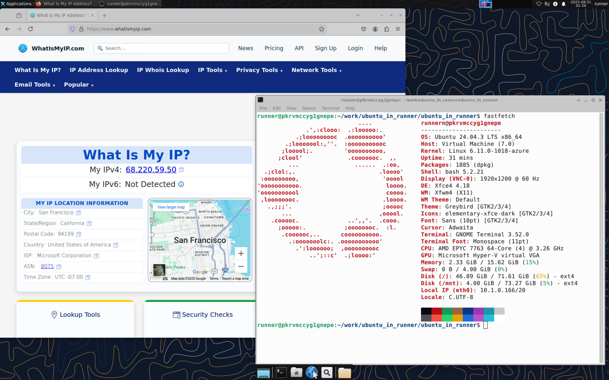

# ubuntu_in_runner

# 🖥️ Ubuntu in GitHub/GitLab Runners

Run a **fully-featured Ubuntu desktop with GUI** inside **free GitHub or GitLab runners** — directly in your browser, no extra software needed.  

## 📌 Repository Links
- GitHub: [sudo-gera/ubuntu_in_runner](https://github.com/sudo-gera/ubuntu_in_runner)  
- GitLab: [sudo-gera/ubuntu-in-runner](https://gitlab.com/sudo_gera/ubuntu-in-runner)

## 🖼️ Preview


## ✨ Features
- 🌐 **Browser-based GUI** — No remote desktop software needed  
  - Powered by [noVNC](https://novnc.com/) + [localhost.run](https://localhost.run/)  
- 🔑 **SSH access** via [tmate](https://github.com/tmate-io/tmate)  
  - Makes it easier to paste commands into remote desktop
- 💬 **Send messages to the runner console**  
  - Great for copying text from your remote machine  
- 🧑‍💻 **No terminal or Linux knowledge required**  
  - Entire setup can be done in the browser  

# 🟣 How to Use on GitHub

⚠️ **Important Tip:** Don’t use your *main account*. GitHub gives only **2000 free minutes per month**.
If you use your main account and run out, GitHub may start charging if your card is linked.

---

### 🏁 Step 1 — Create Your Repo

1. Create a **free GitHub account** (or use a spare one).
2. Click the **green "New Repository"** button.
3. On the top-right, click **"Import a repository"**.
4. Paste this repo link:

   ```
   https://github.com/sudo-gera/ubuntu_in_runner
   ```

   (leave username/password blank).
5. Give your repo a **nice name**.
6. **Set it to Private** (⚠️ VERY IMPORTANT — if it’s public, strangers can access your desktop & passwords!).
7. Click **"Create repository"**. 🎉

---

### 🏁 Step 2 — Start Ubuntu

Every time you want to launch Ubuntu, you’ll need to **trigger the runner**:

1. Open your repo → click **README.md** file.
2. Click the ✏️ **pencil button** (in the top left corner).
3. Add just one blank line at the end.
4. Click green button 🟩 **"Commit changes"**.
5. When popup appears, click same button on it.
5. Wait **about 10 minutes**.
6. Go to the **"Actions"** tab at the top.
7. Click the **latest workflow run**.
8. Select **"setup\_and\_start\_VM"**.
9. Look for a link like `lhr.life` → click it.
10. A file list will appear → click **`vnc_lite.html`**.
11. If the window looks too big, press **Ctrl + Shift + - (minus)** a few times until it fits.
12. 🎉 You now have Ubuntu running in your browser!

---

### 🛑 Step 3 — Stop It (Save Minutes)

When you’re done:

1. Go back to your repo.
2. Open the **"Actions"** tab.
3. Cancel any running jobs. ✅

---

# 🟠 How to Use on GitLab

⚠️ **Important Tip:** Don’t use your *main account*. GitLab gives only **400 free minutes per month**.
If you use your main account and run out, GitHub may start charging if your card is linked.

---

### 🏁 Step 1 — Create Your Repo

1. Create a **free GitLab account** (or use a spare one).
2. Open the GitLab repo: [https://gitlab.com/sudo_gera/ubuntu-in-runner](https://gitlab.com/sudo_gera/ubuntu-in-runner)
3. Click the **"Fork"** button (top right).
4. Choose a space named like your username.
5. Give your repo a **nice name**.
6. **Set it to Private** (⚠️ VERY IMPORTANT — if it’s public, strangers can access your desktop & passwords!).
7. Done — repo created! 🎉

---

### 🏁 Step 2 — Start Ubuntu

Each time you want to launch Ubuntu:

1. Open your repo → click **README.md**.
2. Click **"Edit" → "Edit single file"**.
3. Add just one blank line at the end.
4. Click green button 🟦 **"Commit changes"**.
5. When popup appears, click same button on it.
5. Wait **about 10 minutes**.
6. On the left sidebar → go to **Build → Pipelines**.
7. Click the **latest pipeline**.
8. Select **"install and print connection links"**.
9. Look for a link like `lhr.life` → click it.
10. A file list will appear → click **`vnc_lite.html`**.
11. If the window looks too big, press **Ctrl + Shift + - (minus)** a few times.
12. 🎉 Enjoy Ubuntu in your browser!

---

### 🛑 Step 3 — Stop It (Save Minutes)

When you’re done:

1. Go back to your repo.
2. Go to **Build → Pipelines** on the left panel.
3. Cancel all running jobs. ✅

---

## 💡 Tips

* It always takes **\~10 minutes** to start the system (be patient).
* Always **cancel jobs** after use to save minutes.
* Keep your repo **private** for your own safety.

---

## 🎉 That’s It!

You now have a **free Ubuntu desktop with GUI** inside GitHub/GitLab runners — straight from your browser.

🔥 No setup. No installs. No Linux knowledge required.

